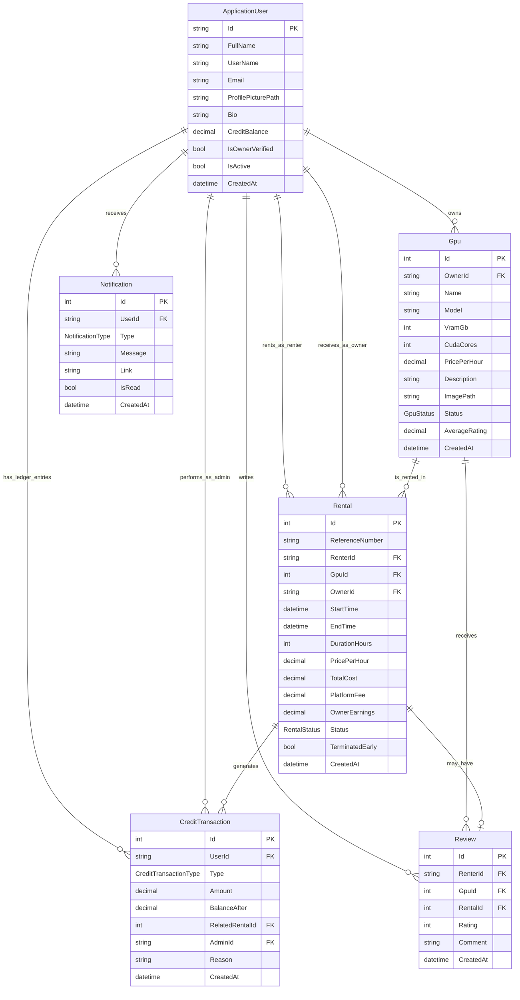

# GPURent Entity Relationships

This document explains how the current core domain entities are connected. It is based on the project specification and the model classes currently under `Models/`.

## ERD

## Entity Roles

`ApplicationUser` represents a platform account. A user can rent GPUs, own GPU listings, receive notifications, write reviews, and have credit ledger entries. Admin actions are also tracked through this entity using `AdminId` on credit transactions.

`Gpu` represents a rentable GPU listing. Each GPU belongs to one owner and can appear in many rentals and reviews.

`Rental` is the main transaction record. It connects the renter, owner, and GPU. It also stores price snapshots such as `PricePerHour`, `TotalCost`, `PlatformFee`, and `OwnerEarnings` so rental history remains accurate even if the GPU price changes later.

`CreditTransaction` is the unified credit audit ledger. Every credit movement should be recorded here, including initial credits, admin grants, rental charges, owner earnings, refunds, and revokes.

`Review` stores renter feedback after a rental. It belongs to one renter, one GPU, and one rental.

`Notification` stores user-facing system messages such as rental confirmations, credit grants, and listing approvals or rejections.

## Relationship Summary

| Relationship | Type | Meaning |
| --- | --- | --- |
| `ApplicationUser` to `Gpu` | One-to-many | One owner can list many GPUs. |
| `ApplicationUser` to `Rental` as renter | One-to-many | One user can rent many GPUs. |
| `ApplicationUser` to `Rental` as owner | One-to-many | One owner can receive many rentals for their GPUs. |
| `ApplicationUser` to `CreditTransaction` | One-to-many | One user can have many credit ledger entries. |
| `ApplicationUser` to `CreditTransaction` as admin | One-to-many | One admin can perform many credit grants or revokes. |
| `ApplicationUser` to `Review` | One-to-many | One renter can write many reviews. |
| `ApplicationUser` to `Notification` | One-to-many | One user can receive many notifications. |
| `Gpu` to `Rental` | One-to-many | One GPU can be rented many times over its lifetime. |
| `Gpu` to `Review` | One-to-many | One GPU can receive many reviews. |
| `Rental` to `CreditTransaction` | One-to-many | One rental can generate charge, earning, and refund entries. |
| `Rental` to `Review` | Zero-or-one to one | A rental may have one review after completion. |

## Business Rules From The Spec

- Every new user starts with `500` credits.
- Users can be both renters and owners.
- Owners must be verified before listing GPUs.
- Suspended or inactive users cannot rent or list GPUs.
- GPU listings start as `Pending` and require admin approval before becoming rentable.
- Rental duration must be at least `1` hour and at most `168` hours.
- Rental credits are deducted upfront when the rental is confirmed.
- GPU owners earn credits from rentals minus the platform fee.
- Early termination should refund unused time on a prorated basis.
- Every credit movement must be logged in `CreditTransaction` with a timestamp and reason.
- Reviews should only be created after a rental is completed.

## Current Implementation Note

`ApplicationUser` is currently a standalone domain model. When ASP.NET Identity is wired in later, this class should be updated to extend Identity's user type, usually `IdentityUser`, while preserving the GPURent-specific properties and relationships documented here.
